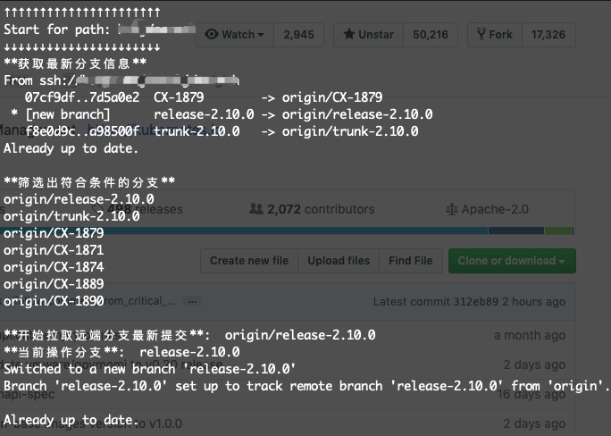

### GitUpdate

**自动拉取本地Git仓库最新的分支版本**

#### 项目初衷

当本地有多个参与的项目需要更新拉取最新分支代码时，每个项目中都要执行 `git pull` 命令也是一件很繁琐的事情。所以一时兴起，用Golang实现了一个自动拉取Git项目最新分支版本的程序。

正所谓：**Sharpening your axe will not delay your job of chopping wood.**

由于原始项目涉及到一些原公司内部项目文件，所以此版本是经过整理后的开源版本（以下示例中的项目名称仅供参考）。

*****

#### 参数说明

```
./gitupdate -bd=./test -od=my_proxy -bc=5 -ck=true
```

* `-bd` - `defalut current path` 指定要检索的基目录
* `-od` - `only one or some dir name mutiple between with ,` 设置只检索基目录下的一个目录或多个目录
* `-bc` - `pull branch count default 3` 获取最近提交分支总数
* `-ed` - `exclude one or some dir name mutiple between with ,` 排除基目录下的某一个或多个目录
* `-ck` - `verify directory filtering results` 检查模式，仅验证目录筛选结果

*****

#### 执行

设置检索的基目录为 `./test` ，设置只检索基目录下的 `celery` 项目目录：

```
./gitupdate -bd=./test -od=celery
```

#### 执行示例

```
➜ ./gitupdate -bd=./my_project
basepath: ./my_project ; oneDirName:
检索到目录: my_project/logger
检索到目录: my_project/client_lib
检索到目录: my_project/options
检索到目录: my_project/abc_loger
[my_project/logger my_project/client_lib my_project/options my_project/abc_loger]
start range
Start for path: my_project/logger
↓↓↓↓↓↓↓↓↓↓↓↓↓↓↓↓↓↓↓↓↓↓
Switched to branch 'master'
Your branch is up to date with 'origin/master'.

Already up to date.

↑↑↑↑↑↑↑↑↑↑↑↑↑↑↑↑↑↑↑↑↑↑
Start for path: my_project/client_lib
↓↓↓↓↓↓↓↓↓↓↓↓↓↓↓↓↓↓↓↓↓↓
Switched to branch 'master'
Your branch is up to date with 'origin/master'.

From ssh://the_company/my_project/client_lib
   2a4c8fe..4ad287f  master     -> master
   2a4c8fe..4ad287f  master     -> origin/master
warning: fetch updated the current branch head.
fast-forwarding your working tree from
commit 2a4c8fe9101ee1d5738336ce01e5de2ea90776a9.
Already up to date.

↑↑↑↑↑↑↑↑↑↑↑↑↑↑↑↑↑↑↑↑↑↑
Start for path: my_project/options
↓↓↓↓↓↓↓↓↓↓↓↓↓↓↓↓↓↓↓↓↓↓
Already on 'master'
Your branch is up to date with 'origin/master'.

Already up to date.

↑↑↑↑↑↑↑↑↑↑↑↑↑↑↑↑↑↑↑↑↑↑
Start for path: my_project/abc_loger
↓↓↓↓↓↓↓↓↓↓↓↓↓↓↓↓↓↓↓↓↓↓
Switched to branch 'master'
Your branch is up to date with 'origin/master'.

Already up to date.

↑↑↑↑↑↑↑↑↑↑↑↑↑↑↑↑↑↑↑↑↑↑

```




*****

#### 相关git命令参考

##### 按照最近的提交排序前n个分支

```
$ git for-each-ref --sort=-committerdate --format='%(committerdate:short) %(refname:short)' --count=15 refs/remotes/origin/
```

* [git – 如何获取未合并到master的分支列表,按最近提交的顺序排序？ - 代码日志](https://codeday.me/bug/20181218/461363.html)

执行结果如：

```
2019-02-22 origin/login-aaa
2018-11-28 origin/login-bbb
2018-11-21 origin/login-ccc
2018-09-20 origin/vvv-ddd
2018-09-06 origin/vvv-eee
2018-08-08 origin/vvv-fff
2018-07-25 origin/release_0.6
2018-07-04 origin/zzz-hhh
2018-06-14 origin/zzz-kkk
2018-04-17 origin/HCC-181
2018-04-16 origin/master
2018-04-16 origin/HEAD
2018-03-29 origin/develop
```

对以上命令进行调整，将输出内容更改：

获取远端分支的具体分支名 `refs/remotes/origin/`

```
git for-each-ref --sort=-committerdate --format='%(refname:short)' --count=3 refs/remotes/origin/


➜ git for-each-ref --sort=-committerdate --format='%(refname:short)' --count=3 refs/remotes/origin/
origin/login-aaa
origin/login-bbb
origin/login-ccc
```

获取本地分支的分支名称，可以使用 `refs/heads/` :

```
git for-each-ref --sort=-committerdate --format='%(refname:short)' --count=3 refs/heads/


➜ git for-each-ref --sort=-committerdate --format='%(refname:short)' --count=3 refs/heads/
login-aaa
login-bbb
login-ccc
```

* [Git the last 10 branches you've worked on (Example)](https://coderwall.com/p/jhucga/git-the-last-10-branches-you-ve-worked-on)


*****

##### test

```
git branch --sort=-committerdate

git branch --sort=-committerdate --format='%(committerdate:short) %(refname:short)'


git for-each-ref --sort=-committerdate --format='%(refname:short)' --count=3 refs/heads/


heads：描述当前仓库所有本地分支
tags：描述当前仓库的tag信息
remotes：remotes文件夹将所有由 git remote 命令创建的所有远程分支存储为单独的子目录
```

******


* Last Updated: 2019-03-28
